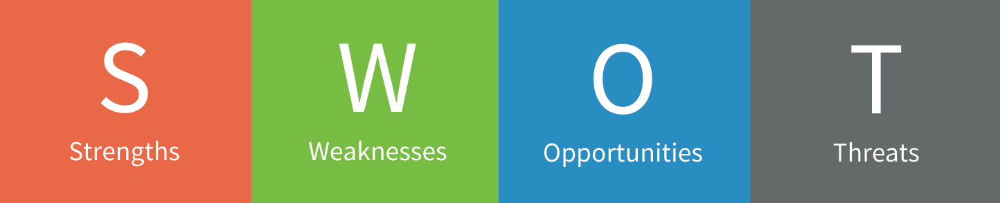

# Learning Management System
>A learning management system (LMS) is a software application for the administration, documentation, tracking, reporting and delivery of educational courses or training programs.They help the instructor deliver material to the students and other assignments, track student progress, and manage record-keeping. LMSs are focused on online learning delivery but support a range of uses, acting as a platform for fully online courses, as well as several hybrid forms, such as blended learning and flipped classrooms. LMSs can be complemented by learning technologies such as a training management system to manage instructor-led training or a Learning Record Store to store and track learning data.

## Purpose
An LMS delivers and manages instructional content, and typically handles student registration, online course administration, and tracking, and assessment of student work. Some LMSs help identify progress towards learning or training goals. Most LMSs are web-based, to facilitate access. LMSs are often used by regulated industries (e.g. financial services and biopharma) for compliance training.

## SWOT

### STRENGTHS
- Long existence & well accepted Provides a central & manageable system for online & offline training STRENGTHS
- Capable of integrating with the workflow STRENGTHS
- Capable of integrating with other existing HRMS/IS
- Capable of integrating with other existing HRMS/IS Exhaustive MIS reporting
- Works excellent for course management, delivery & tracking of formal learning
- Capable of managing competency & talent management 
### WEAKNESSES
- Focused on control & managing more than learner experience 
- Not ready for Web 2.0 experience and offers outdated way of course WEAKNESSES access 
- Focused on formal learning to be pushed to learners No real standards govern LMS development
- Overall customer experience with LMS is not consistent 
### OPPORTUNITIES
- To create learner-centric environments rather thancentralized course delivery system through Social & Informal learning
- To offer talent management functionality in the context of both formal & informal learning 
### THREATS
- Slow to respond to changing learner needs
- As market fragmentation increases, more LMSsystems will become out of tune to the market demands thereby creating a higher level of dissonance with the LMS
- Social networking tools could extend to take over some of the LMS functionality posing a new competition (already are) to LMS

---
## Use Case in Educational Institution
1. Provide the information of student,quiz ,assigments etc.
2. manage the information of student.
3. show the description and information of the course and faculty.
4. It increases the efficiency of managing the course for student.
5. It automates the existing manual system by he help of internet.
6. To assist the staff in capturing the effort spent on their respective working areas.
7. Provide searching facilities & REDUCES PAPERORK.
